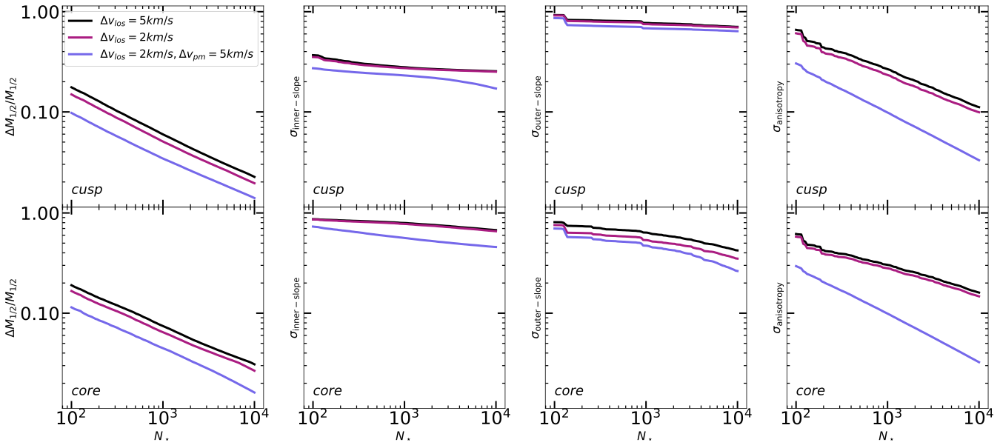
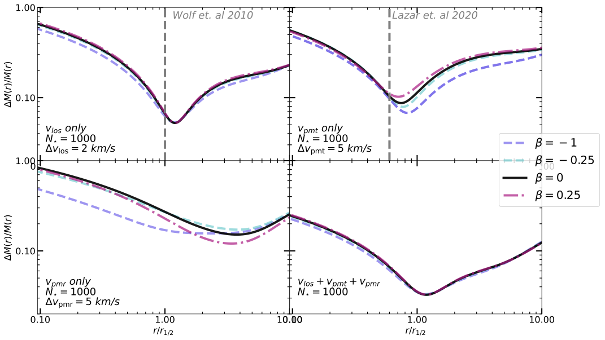
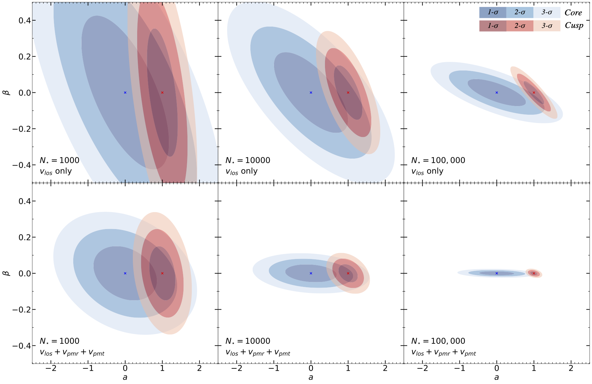

# dmForecast

dmForecast is a tool for forecasting uncertainties on properties of dwarf galaxy Dark Matter halos (e.g., shape of the density profile or enclosed mass) that is attainable through jeans modeling.

Using Fisher matrices, which are constructed from the derivatives of the likelihood function used in traditional MCMC mass modeling methods, we can predict how well we will be able to constraint the properties of systems we're interested in.

With this this method we can quickly (compared to full analysis on mock data for example) how well we can constrain properties (e.g. the inner-slope of a dark matter halo) based on how many stars we observe, the precision of our measurements, as well as explore degeneracies that arise from using spherical jeans modeling. 

Example usage provided in example.ipynb

With this tool you can explore how errors scale with the number of stars you observe, and the accuracy of your observations:

Explore where errors are minimized:

Study degeneracies and the information needed to break them:

Although the code in this github can be used to recreate the above plots, optimizations that i made throughout the project to speed up integration have not yet been made implemented. This will involve using numba which in my experience has not worked well with classes. In the future i'll also switch to an auto-differentiator. The only reason i didn't do that here is because i couldn't figure out how to apply an auto-differentiator to the Hypergeometric function that I use to calculate the enclosed mass.

# Attribution

